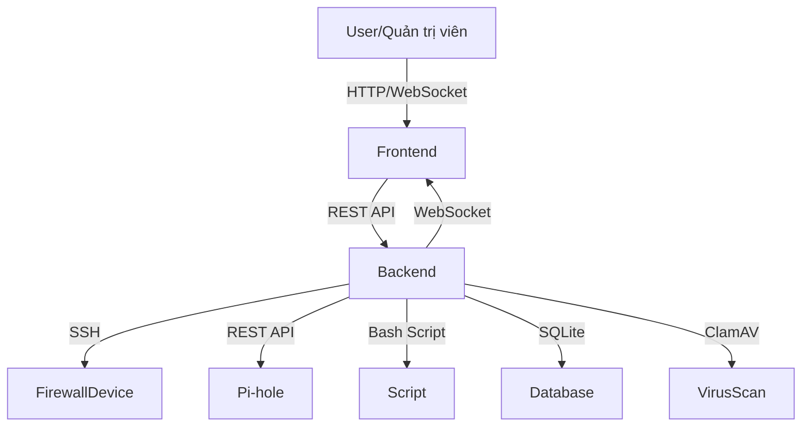

# Firewall Management System

## 📝 Tổng quan dự án

Hệ thống quản lý Firewall là một nền tảng web cho phép quản trị viên giám sát, cấu hình và bảo vệ các thiết bị firewall trong mạng nội bộ. Dự án tích hợp nhiều tính năng bảo mật, quản lý truy cập, phân tích lưu lượng, chống virus, cách ly thiết bị, và đặc biệt là tích hợp với Pi-hole để lọc quảng cáo và domain độc hại.

---

## 🗺️ Sơ đồ kiến trúc tổng thể


---

## 📂 Cấu trúc thư mục tổng quan

```
├── backend/                # Toàn bộ mã nguồn backend (Node.js, Express)
│   ├── server.js           # File chính khởi tạo server, API, session, logic
│   ├── commands/           # Module thực thi lệnh SSH
│   │   └── sshExecutor.js
│   ├── script/             # Các bash script thao tác firewall, log, cách ly, virus
│   │   ├── getfirewall.sh
│   │   ├── add-iptables-rule.sh
│   │   ├── fixiptables.sh
│   │   ├── quaratine.sh
│   │   ├── analyze-log.sh
│   │   ├── traffic_stats.sh
│   │   └── find-owner-from-ip.sh
│   ├── devices.db          # SQLite database lưu thông tin thiết bị
│   ├── Dockerfile          # Đóng gói backend thành container
│   └── ...
├── public/                 # Toàn bộ mã nguồn frontend
│   ├── html/               # Trang đăng nhập, dashboard
│   │   ├── login.html
│   │   └── index.html
│   ├── pages/              # Các trang tính năng
│   │   ├── firewall/       # Quản lý rule firewall
│   │   ├── clamav/         # Quét virus
│   │   ├── quaratine/      # Cách ly thiết bị
│   │   ├── ad_blocker/     # Chặn quảng cáo
│   │   ├── web_filter/     # Lọc web
│   │   ├── charts/         # Thống kê, phân tích
│   │   └── ...
│   ├── assets/js/          # Toàn bộ logic JS cho từng tính năng
│   │   ├── register_device.js
│   │   ├── unlink-device.js
│   │   ├── firewall.js, addrulesFirewall.js, themrulemanual.js
│   │   ├── pihole-session.js
│   │   ├── ad_blocker.js, web-filtering.js
│   │   ├── analysis.js, chart_social.js
│   │   └── ...
│   ├── partials/           # Sidebar, navbar, footer dùng chung
│   │   ├── _sidebar.html
│   │   ├── _navbar.html
│   │   └── _footer.html
│   ├── css/, scss/         # Style giao diện
│   └── ...
├── package.json            # Định nghĩa dependencies backend
├── main.js                 # (Nếu có) entry point khác
└── README.md               # Tài liệu này
```

---

## ⚙️ Công nghệ sử dụng
- **Backend:** Node.js, Express.js, SQLite, SSH2, WebSocket, dotenv
- **Frontend:** HTML, CSS, JavaScript, Bootstrap, Chart.js, WebSocket
- **Khác:** Bash script, Docker, Pi-hole, ClamAV

---

## 🚀 Tính năng chính

### 1. Quản lý thiết bị firewall
- Đăng ký, lưu trữ, mã hóa thông tin thiết bị (IP, user, password)
- Kiểm tra kết nối SSH trước khi lưu
- Đăng nhập, duy trì session, timeout tự động
- Hủy liên kết, xóa thiết bị, clear session

### 2. Quản lý firewall (iptables)
- Xem, thêm, sửa, xóa rule firewall qua giao diện
- Thực thi lệnh qua SSH bằng script bash
- Theo dõi trạng thái realtime, log thay đổi

### 3. Tích hợp Pi-hole
- Quản lý domain bị chặn, nhóm, danh sách whitelist/blacklist
- Proxy API tới Pi-hole, xác thực session, tự động gia hạn
- Thống kê domain, nhóm, trạng thái FTL

### 4. Chống virus (ClamAV)
- Quét virus từ xa, xem báo cáo, cấu hình lịch quét
- Cách ly file nhiễm, thông báo admin

### 5. Cách ly & khôi phục thiết bị
- Cách ly thiết bị khi phát hiện vi phạm
- Khôi phục thiết bị, lưu lịch sử cách ly

### 6. Phân tích hành vi, thống kê
- Biểu đồ truy cập, phân tích log, lưu lượng mạng
- Báo cáo chi tiết, cảnh báo realtime

### 7. Quản lý truy cập web, chặn quảng cáo
- Lọc domain, nhóm domain, thống kê domain bị chặn
- Quản lý whitelist/blacklist

---

## 📁 Mô tả chi tiết các thành phần

### Backend
- **server.js**: File trung tâm, khởi tạo Express server, quản lý session, routing, xác thực, proxy API, quản lý thiết bị, firewall, Pi-hole, ClamAV, logging, WebSocket. Sử dụng SQLite để lưu thông tin thiết bị. Tích hợp SSH2 để thao tác từ xa với firewall. Có các endpoint RESTful cho quản lý thiết bị, firewall, log, Pi-hole, ClamAV, thống kê hệ thống. Xử lý xác thực session, popup password, và quản lý session cho từng thiết bị.
- **commands/sshExecutor.js**: Module thực thi lệnh SSH tới thiết bị firewall. Trả về kết quả hoặc lỗi cho các thao tác như kiểm tra trạng thái, thêm/xóa rule, quét virus.
- **script/**: Chứa các bash script phục vụ cho các thao tác hệ thống:
  - `getfirewall.sh`, `add-iptables-rule.sh`, `fixiptables.sh`: Quản lý rule iptables.
  - `quaratine.sh`: Cách ly thiết bị.
  - `analyze-log.sh`, `traffic_stats.sh`, `find-owner-from-ip.sh`: Phân tích log, thống kê lưu lượng, truy vết IP.
  - Các script này được gọi từ backend qua SSH.
- **uploads/**, **downloads/**: Lưu trữ file tạm thời khi upload/download cấu hình, log, hoặc báo cáo.
- **Dockerfile**: Hỗ trợ đóng gói backend thành container.

### Frontend
- **public/html/**: `login.html`: Trang đăng nhập, chọn thiết bị, xác thực. `index.html`: Dashboard chính, hiển thị trạng thái hệ thống, truy cập các tính năng.
- **public/pages/**: `firewall/`: Quản lý rule, thêm/xóa/sửa, xem trạng thái firewall. `clamav/`: Quét virus, xem báo cáo, cấu hình ClamAV. `quaratine/`: Quản lý thiết bị bị cách ly, khôi phục. `ad_blocker/`, `web_filter/`: Quản lý domain, nhóm, lọc web. `charts/`: Thống kê, biểu đồ truy cập, phân tích hành vi. `forms/`: Biểu mẫu nhập liệu, cấu hình.
- **public/assets/js/**: `register_device.js`: Đăng ký thiết bị, validate, gửi API. `unlink-device.js`: Hủy liên kết thiết bị, xác nhận, cập nhật UI. `firewall.js`, `addrulesFirewall.js`, `themrulemanual.js`: Quản lý rule firewall. `pihole-session.js`: Quản lý session với Pi-hole, xác thực, gia hạn, logout, retry. `ad_blocker.js`, `web-filtering.js`: Quản lý domain, nhóm, danh sách chặn. `analysis.js`, `chart_social.js`: Phân tích, thống kê, vẽ biểu đồ. `sidebar_info.js`: Cập nhật thông tin sidebar, trạng thái thiết bị. Nhiều file JS khác cho từng tính năng nhỏ, tối ưu UI/UX.
- **public/partials/**: `_sidebar.html`, `_navbar.html`, `_footer.html`: Thành phần giao diện dùng chung, điều hướng, thông tin trạng thái.
- **public/scss/**, **public/css/**: Style cho toàn bộ giao diện, responsive, theme.

### Database
- **devices.db**: Lưu thông tin thiết bị firewall đã đăng ký: tên, IP, username, password (mã hóa). Được truy cập và cập nhật qua backend.

---

## 🔄 Luồng hoạt động chi tiết

### Đăng ký thiết bị mới
- Người dùng nhập thông tin thiết bị trên giao diện.
- Frontend validate và gửi API `/register-device`.
- Backend kiểm tra trùng lặp, test SSH, mã hóa password, lưu vào DB.
- Nếu thành công, thiết bị xuất hiện trong danh sách, có thể đăng nhập.

### Đăng nhập thiết bị
- Người dùng chọn thiết bị, nhập thông tin nếu cần.
- Backend xác thực, tạo session, kiểm tra SSH.
- Nếu thành công, chuyển sang dashboard, lưu thông tin session.

### Quản lý firewall
- Giao diện cho phép xem, thêm, sửa, xóa rule.
- Các thao tác gửi về backend, backend thực thi qua SSH bằng các script bash.
- Kết quả trả về frontend, cập nhật UI và log.

### Tích hợp Pi-hole
- Khi cần thao tác với Pi-hole (quản lý domain, nhóm, thống kê), frontend sử dụng `pihole-session.js` để đảm bảo có session hợp lệ.
- Gửi request kèm token qua backend, backend proxy tới Pi-hole API.
- Kết quả trả về frontend, hiển thị cho người dùng.

### Quản lý cách ly & khôi phục
- Khi phát hiện vi phạm, thiết bị có thể bị cách ly (thực thi script qua SSH).
- Quản trị viên có thể khôi phục thiết bị từ giao diện.
- Lịch sử cách ly được lưu lại để truy vết.

### Quản lý chống virus (ClamAV)
- Cho phép quét virus từ xa, xem báo cáo, cấu hình lịch quét.
- Kết quả quét được lưu lại, thông báo nếu phát hiện file nhiễm.

### Phân tích hành vi, thống kê
- Sử dụng Chart.js, các file JS phân tích log, lưu lượng, vẽ biểu đồ.
- Dữ liệu lấy từ backend hoặc các script phân tích log.

---

## 🛡️ Bảo mật & session
- Mã hóa password thiết bị khi lưu vào DB.
- Session timeout, chỉ lưu thông tin cần thiết trong session.
- Tất cả thao tác nhạy cảm đều yêu cầu xác thực.
- Các request tới Pi-hole đều qua proxy backend, không lộ thông tin nội bộ.
- Các script bash được kiểm soát chặt chẽ, chỉ thực thi với quyền hạn cho phép.
- CSRF protection, input validation, SQL injection prevention.
- Đổi mật khẩu mặc định, không commit file .env lên git.
- Chỉ mở port cần thiết, dùng HTTPS nếu triển khai thực tế.

---

## 📚 API & Script chi tiết

### Backend API chính
- `POST /login` – Đăng nhập thiết bị
- `GET /logout` – Đăng xuất, clear session
- `POST /register-device` – Đăng ký thiết bị mới
- `DELETE /delete-device/:id` – Xóa thiết bị
- `GET /get-registered-devices` – Lấy danh sách thiết bị
- `POST /add-firewall-rule` – Thêm rule firewall
- `POST /delete-firewall-rule` – Xóa rule firewall
- `POST /get-firewall-from-table` – Lấy thông tin firewall
- `GET /api/proxy/domains` – Quản lý domain Pi-hole
- `GET /api/proxy/groups` – Quản lý nhóm Pi-hole
- `GET /api/proxy/lists` – Quản lý danh sách Pi-hole
- `GET /api/proxy/info/ftl` – Thông tin FTL Pi-hole
- `POST /api/verify-popup-password` – Xác thực mật khẩu popup
- ...

### Script bash tiêu biểu
- `getfirewall.sh` – Lấy danh sách rule iptables
- `add-iptables-rule.sh` – Thêm rule mới
- `fixiptables.sh` – Sửa rule iptables
- `quaratine.sh` – Cách ly thiết bị
- `analyze-log.sh` – Phân tích log
- `traffic_stats.sh` – Thống kê lưu lượng
- `find-owner-from-ip.sh` – Truy vết IP

### Quản lý SSH
- Tất cả thao tác hệ thống đều thực thi qua SSH (module `sshExecutor.js`)
- Kết nối, thực thi lệnh, trả về kết quả hoặc lỗi

---

## 🖥️ Frontend chi tiết

### Trang chính
- `login.html`: Đăng nhập, chọn thiết bị, xác thực
- `index.html`: Dashboard tổng quan, truy cập các tính năng

### Các trang tính năng
- `pages/firewall/`: Quản lý rule, trạng thái firewall
- `pages/clamav/`: Quét virus, xem báo cáo
- `pages/quaratine/`: Quản lý cách ly thiết bị
- `pages/ad_blocker/`, `pages/web_filter/`: Quản lý domain, nhóm, lọc web
- `pages/charts/`: Thống kê, phân tích
- `pages/forms/`: Biểu mẫu nhập liệu, cấu hình

### Các file JS chính
- `register_device.js`: Đăng ký thiết bị, validate, gửi API
- `unlink-device.js`: Hủy liên kết thiết bị, xác nhận, cập nhật UI
- `firewall.js`, `addrulesFirewall.js`, `themrulemanual.js`: Quản lý rule firewall
- `pihole-session.js`: Quản lý session với Pi-hole, xác thực, gia hạn, logout, retry
- `ad_blocker.js`, `web-filtering.js`: Quản lý domain, nhóm, danh sách chặn
- `analysis.js`, `chart_social.js`: Phân tích, thống kê, vẽ biểu đồ
- `sidebar_info.js`: Cập nhật thông tin sidebar, trạng thái thiết bị
- Nhiều file JS khác cho từng tính năng nhỏ, tối ưu UI/UX

### Partial HTML
- `_sidebar.html`, `_navbar.html`, `_footer.html`: Thành phần giao diện dùng chung, điều hướng, trạng thái

---

## 🧑‍💻 Hướng dẫn phát triển & mở rộng

### Thêm tính năng mới
1. Tạo file HTML trong `public/pages/`
2. Thêm route API trong `backend/server.js`
3. Tạo file JS tương ứng trong `public/assets/js/`
4. Thêm menu item trong `_sidebar.html`
5. Cập nhật README.md nếu cần

### Thêm script hệ thống
1. Viết script bash trong `backend/script/`
2. Đảm bảo script an toàn, kiểm soát quyền
3. Gọi script từ backend qua SSH hoặc child_process

### Thêm API mới
1. Định nghĩa endpoint trong `server.js`
2. Xác thực, validate input, xử lý logic
3. Trả về kết quả rõ ràng, log lỗi nếu có

---

## 🛠️ Vận hành, bảo trì, troubleshooting

### Khởi động hệ thống
1. Cài Node.js >= 14.x, SQLite3, ClamAV, Pi-hole
2. Clone repo, `npm install`
3. Tạo file `.env` với biến `POPUP_PASSWORD=...`
4. Chạy `node backend/server.js`
5. Truy cập `http://localhost:1234`

### Backup/Restore
- Backup file `devices.db` định kỳ
- Backup log, cấu hình firewall, script nếu chỉnh sửa

### Các lỗi thường gặp
- **Không kết nối được SSH:** Kiểm tra IP, user, password, firewall thiết bị, quyền truy cập
- **Không truy cập được Pi-hole API:** Kiểm tra session, token, trạng thái Pi-hole, cấu hình proxy
- **Không quét được virus:** Kiểm tra ClamAV, quyền thực thi script, log lỗi
- **Lỗi database:** Kiểm tra quyền ghi file, cấu trúc DB, log backend
- **Lỗi giao diện:** Kiểm tra console log, network request, cập nhật lại JS/CSS

### Bảo mật
- Đổi mật khẩu mặc định, không commit file .env lên git
- Chỉ mở port cần thiết, dùng HTTPS nếu triển khai thực tế
- Giới hạn quyền thực thi script, kiểm soát input

---

## 📝 Checklist bàn giao & lưu ý
- [ ] Đảm bảo README luôn cập nhật, rõ ràng
- [ ] Backup định kỳ database, log, cấu hình firewall
- [ ] Đổi mật khẩu mặc định, bảo vệ file .env
- [ ] Kiểm tra log backend, log script, log Pi-hole khi gặp lỗi
- [ ] Ghi chú lại các thay đổi lớn vào README
- [ ] Đảm bảo các script bash an toàn, không để lộ thông tin nhạy cảm
- [ ] Kiểm tra các endpoint API, xác thực, phân quyền
- [ ] Đảm bảo các file JS chính có comment, giải thích rõ ràng
- [ ] Đảm bảo giao diện responsive, dễ sử dụng
- [ ] Đảm bảo các tính năng realtime hoạt động ổn định (WebSocket)

---

## 📋 Ghi chú & liên hệ
- Đọc kỹ từng phần README trước khi phát triển mới
- Ghi chú lại các thay đổi lớn vào README để người sau dễ tiếp nhận
- Nếu có vấn đề, kiểm tra log backend, log script, log Pi-hole trước khi hỏi support
- Đảm bảo backup định kỳ database, log, cấu hình firewall.

---

## 📋 Ví dụ flow thực tế

### Thêm rule firewall
1. Người dùng nhập rule trên giao diện → gửi API `/add-firewall-rule`
2. Backend xác thực, gọi script `add-iptables-rule.sh` qua SSH
3. Script thực thi, trả về kết quả → backend trả về frontend
4. Giao diện cập nhật trạng thái, log

### Quản lý domain Pi-hole
1. Người dùng thao tác trên giao diện → gọi API `/api/proxy/domains`
2. Backend kiểm tra session Pi-hole, proxy request
3. Nhận kết quả, trả về frontend, cập nhật UI

---

## 🤝 Đóng góp & phát triển
1. Fork repository
2. Tạo branch mới cho tính năng/bugfix
3. Commit, push lên branch
4. Tạo Pull Request, mô tả rõ thay đổi

---

## 📄 License
[License information]

## 👥 Authors
[Author information]

## 🙏 Acknowledgments
- Pi-hole
- ClamAV
- Express.js
- SQLite
- Linux community